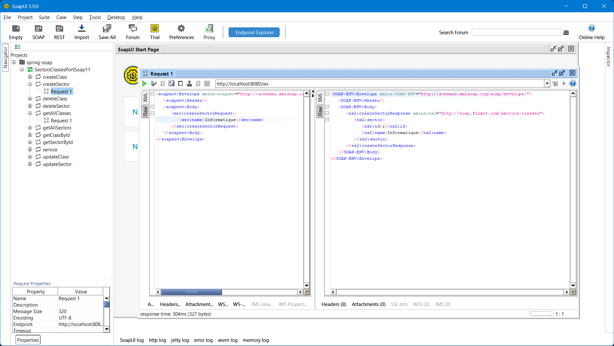

# Simple SOAP API



Une API SOAP Spring Boot exposant des services web pour deux entités:
- `Sector` (table `sectors`)
- `SchoolClass` (table `classes`) liée à `Sector` par une relation many-to-one.

> 📝 **Note**: Cette API SOAP est une conversion directe de l'API REST [`simple-api`](https://github.com/0xc007b/isilab-spring-api). Elle offre les mêmes fonctionnalités CRUD mais utilise le protocole SOAP/XML au lieu de REST/JSON.

## Tech stack

- Java 17
- Spring Boot 3.5 (Web Services, Data JPA, Validation)
- PostgreSQL (driver JDBC)
- Lombok
- MapStruct (génération automatique de mappers)
- JAXB (génération de classes à partir de XSD)
- DevTools (optionnel en dev)
- WSDL4J (génération WSDL)

## Configuration

La configuration par défaut est surchargée par des variables d'environnement. Paramètres principaux:

- `DB_HOST` (def: `localhost`)
- `DB_PORT` (def: `5432`)
- `DB_NAME` (def: `simple_soap_api`)
- `DB_USER` (def: `postgres`)
- `DB_PASSWORD` (def: `postgres`)
- `SERVER_PORT` (def: `8080`)
- `SHOW_SQL` (def: `true`)

JPA/Hibernate:
- `spring.jpa.hibernate.ddl-auto=update` pour auto-créer/mettre à jour le schéma en dev.

SOAP Services:
- `spring.webservices.path=/ws` pour le path des services SOAP
- `spring.webservices.servlet.init.transform-wsdl-locations=true` pour la transformation des URLs WSDL

## Lancer localement

1) Démarrer un PostgreSQL local et créer la base:
~~~sql
CREATE DATABASE simple_soap_api;
-- user/password selon votre installation (par défaut postgres/postgres)
~~~

2) Exporter (éventuellement) les variables d'environnement si vous n'utilisez pas les valeurs par défaut:

Windows PowerShell:
~~~powershell
$env:DB_HOST="localhost"
$env:DB_PORT="5432"
$env:DB_NAME="simple_soap_api"
$env:DB_USER="postgres"
$env:DB_PASSWORD="postgres"
$env:SERVER_PORT="8080"
~~~

3) Lancer l'application:
~~~bash
mvn spring-boot:run
~~~

URLs de base:
- WSDL: http://localhost:8080/ws/sectorsClasses.wsdl
- Services SOAP: http://localhost:8080/ws

## Modèle de données

- `Sector`
  - `id: Long`
  - `name: String` (unique, non nul)
  - Relation `1..*` vers `SchoolClass` (cascade + orphanRemoval)

- `SchoolClass`
  - `id: Long`
  - `className: String` (non nul, unique par `Sector`)
  - `description: String` (optionnel)
  - `sector: Sector` (FK non nul)

## Architecture SOAP

Le projet utilise une architecture SOAP avec:

### Schémas XSD
- `sectors-classes.xsd` : Définit tous les types et opérations SOAP

### Classes générées (JAXB)
- Classes de requêtes et réponses générées automatiquement à partir du XSD
- Namespace: `com.flrxnt.soap.generated`

### Endpoints SOAP
- `SectorEndpoint` : Opérations CRUD pour les secteurs
- `SchoolClassEndpoint` : Opérations CRUD pour les classes

### Mappers
- `SectorMapper` : Conversion entre entités `Sector` et DTOs SOAP
- `SchoolClassMapper` : Conversion entre entités `SchoolClass` et DTOs SOAP

Cette architecture permet :
- Une séparation claire entre le modèle métier et les DTOs SOAP
- Une génération automatique du WSDL
- Une validation des messages XML
- Une gestion centralisée des erreurs via SOAP Faults

## Services SOAP

Namespace: `http://soap.flrxnt.com/sectors-classes`

## Exemples SOAP

### Créer un secteur

Request:
~~~xml
<soapenv:Envelope xmlns:soapenv="http://schemas.xmlsoap.org/soap/envelope/" xmlns:sec="http://soap.flrxnt.com/sectors-classes">
   <soapenv:Header/>
   <soapenv:Body>
      <sec:createSectorRequest>
         <sec:name>Informatique</sec:name>
      </sec:createSectorRequest>
   </soapenv:Body>
</soapenv:Envelope>
~~~

Response:
~~~xml
<soap:Envelope xmlns:soap="http://schemas.xmlsoap.org/soap/envelope/">
   <soap:Body>
      <ns2:createSectorResponse xmlns:ns2="http://soap.flrxnt.com/sectors-classes">
         <ns2:sector>
            <ns2:id>1</ns2:id>
            <ns2:name>Informatique</ns2:name>
         </ns2:sector>
      </ns2:createSectorResponse>
   </soap:Body>
</soap:Envelope>
~~~

### Créer une classe

Request:
~~~xml
<soapenv:Envelope xmlns:soapenv="http://schemas.xmlsoap.org/soap/envelope/" xmlns:sec="http://soap.flrxnt.com/sectors-classes">
   <soapenv:Header/>
   <soapenv:Body>
      <sec:createClassRequest>
         <sec:className>L3 GL</sec:className>
         <sec:description>Licence 3 Génie Logiciel</sec:description>
         <sec:sectorId>1</sec:sectorId>
      </sec:createClassRequest>
   </soapenv:Body>
</soapenv:Envelope>
~~~

Response:
~~~xml
<soap:Envelope xmlns:soap="http://schemas.xmlsoap.org/soap/envelope/">
   <soap:Body>
      <ns2:createClassResponse xmlns:ns2="http://soap.flrxnt.com/sectors-classes">
         <ns2:schoolClass>
            <ns2:id>1</ns2:id>
            <ns2:className>L3 GL</ns2:className>
            <ns2:description>Licence 3 Génie Logiciel</ns2:description>
            <ns2:sectorId>1</ns2:sectorId>
            <ns2:sectorName>Informatique</ns2:sectorName>
         </ns2:schoolClass>
      </ns2:createClassResponse>
   </soap:Body>
</soap:Envelope>
~~~

## Validation & Erreurs SOAP

- Validation via validation métier dans les endpoints
- Gestion centralisée des erreurs via SOAP Faults
- Les erreurs sont retournées sous forme de SOAP Faults avec codes et messages appropriés

Exemple de SOAP Fault:
~~~xml
<soap:Envelope xmlns:soap="http://schemas.xmlsoap.org/soap/envelope/">
   <soap:Body>
      <soap:Fault>
         <faultcode>soap:Server</faultcode>
         <faultstring>SOAP Fault: [CONFLICT] Sector with the same name already exists</faultstring>
         <detail>
            <faultCode>CONFLICT</faultCode>
            <faultString>Sector with the same name already exists</faultString>
         </detail>
      </soap:Fault>
   </soap:Body>
</soap:Envelope>
~~~

Codes d'erreur courants:
- `CLIENT`: Erreur de validation côté client (données manquantes, format incorrect)
- `NOT_FOUND`: Ressource non trouvée
- `CONFLICT`: Conflit (nom déjà existant, violation contrainte unique)
- `SERVER`: Erreur interne du serveur

## Développement

- `spring.jpa.hibernate.ddl-auto=update` pour itérer rapidement en dev
- Activer les logs SQL: `SHOW_SQL=true`
- Installer Lombok dans l'IDE (plugin + activer annotation processing)
- DevTools est présent en `runtime` optionnel (rechargement à chaud côté IDE)

### Génération des classes JAXB

Les classes JAXB sont générées automatiquement à partir du schéma XSD lors du build:

~~~bash
mvn generate-sources
~~~

Les classes générées se trouvent dans `src/main/java/com/flrxnt/soap/generated/`

## Build

- Build JAR:
~~~bash
mvn clean package
~~~
- Le JAR est produit dans `target/simple-soap-api-0.0.1-SNAPSHOT.jar`

## Test des services SOAP

### SoapUI

1. Télécharger et installer SoapUI
2. Créer un nouveau projet SOAP
3. URL WSDL: `http://localhost:8080/ws/sectorsClasses.wsdl`
4. SoapUI génère automatiquement les exemples de requêtes

### Postman

1. Créer une nouvelle requête POST
2. URL: `http://localhost:8080/ws`
3. Headers: `Content-Type: text/xml; charset=utf-8`
4. SOAPAction: (selon l'opération)
5. Body: XML SOAP selon les exemples ci-dessus

### curl

~~~bash
curl -X POST \
  http://localhost:8080/ws \
  -H 'Content-Type: text/xml; charset=utf-8' \
  -H 'SOAPAction: ""' \
  -d '<soapenv:Envelope xmlns:soapenv="http://schemas.xmlsoap.org/soap/envelope/" xmlns:sec="http://soap.flrxnt.com/sectors-classes">
   <soapenv:Header/>
   <soapenv:Body>
      <sec:getAllSectorsRequest/>
   </soapenv:Body>
</soapenv:Envelope>'
~~~

## Documentation WSDL

Une fois l'application démarrée, la documentation WSDL est disponible :

- **WSDL** : http://localhost:8080/ws/sectorsClasses.wsdl

Le WSDL contient :
- Définition de tous les types de données
- Description de toutes les opérations disponibles
- Informations sur les endpoints et bindings
- Schémas XML pour la validation

## Architecture

### Séparation des responsabilités

Le projet suit une architecture en couches claire :

1. **Entités** (`entities/`) : Modèles JPA avec annotations Hibernate
2. **Schémas XSD** (`src/main/resources/schemas/`) : Définition des contrats SOAP
3. **Classes générées** (`generated/`) : DTOs SOAP générés par JAXB
4. **Mappers** (`mappers/`) : Conversion automatique via MapStruct
5. **Repositories** (`repositories/`) : Accès aux données avec Spring Data JPA
6. **Services** (`services/`) : Logique métier et validation
7. **Endpoints** (`endpoints/`) : Points d'entrée SOAP avec gestion des erreurs

### JAXB et Génération de Code

Le projet utilise JAXB pour :
- Génération automatique des classes Java à partir de XSD
- Sérialisation/désérialisation XML automatique
- Validation des messages XML entrants
- Génération automatique du WSDL

### MapStruct

Les mappers utilisent MapStruct pour la conversion entité ↔ DTO SOAP :
- Conversion automatique entre entités JPA et DTOs SOAP
- Support des mappings complexes
- Génération de code à la compilation
- Intégration parfaite avec Lombok

## Différences avec l'API REST

| Aspect | REST API | SOAP API |
|--------|----------|----------|
| **Protocol** | HTTP/JSON | HTTP/XML (SOAP) |
| **Style** | RESTful | RPC-style |
| **Contrat** | OpenAPI/Swagger | WSDL |
| **Format** | JSON | XML |
| **Validation** | Bean Validation | XSD Schema + Business Logic |
| **Erreurs** | HTTP Status Codes | SOAP Faults |
| **URLs** | `/api/sectors`, `/api/classes` | `/ws` (single endpoint) |
| **Documentation** | Swagger UI | WSDL |
| **Test** | curl, Postman REST | SoapUI, Postman SOAP |

## Migration depuis REST

Ce projet est une conversion directe de l'API REST `simple-api`. Les principales adaptations :

1. **Schéma XSD** remplace les DTOs REST
2. **Endpoints SOAP** remplacent les Controllers REST
3. **SOAP Faults** remplacent les ResponseEntity avec codes HTTP
4. **WSDL** remplace la documentation Swagger
5. **Classes JAXB générées** remplacent les DTOs manuels
6. **Même logique métier** conservée dans les services

## Démarrage rapide

1. **Base de données** : Créer la base PostgreSQL
```sql
CREATE DATABASE simple_soap_api;
```

2. **Build** : Compiler le projet
```bash
mvn clean package -DskipTests
```

3. **Lancement** : Démarrer l'application
```bash
mvn spring-boot:run
```

4. **Test** : Accéder au WSDL
- WSDL : http://localhost:8080/ws/sectorsClasses.wsdl
- Services : http://localhost:8080/ws

5. **Exemples** : Voir [`samples/soap-requests.md`](samples/soap-requests.md) pour des exemples de requêtes SOAP

## Structure du projet

```
simple-soap-api/
├── src/main/java/com/flrxnt/soap/
│   ├── entities/          # Entités JPA (identiques à simple-api)
│   ├── repositories/      # Repositories JPA (identiques à simple-api)
│   ├── services/          # Services métier (adaptés pour SOAP)
│   ├── mappers/           # Mappers MapStruct (entités ↔ DTOs SOAP)
│   ├── endpoints/         # Endpoints SOAP (@Endpoint)
│   ├── config/            # Configuration SOAP et WSDL
│   ├── exceptions/        # Gestion des SOAP Faults
│   └── generated/         # Classes JAXB générées
├── src/main/resources/
│   └── schemas/           # Schémas XSD
├── samples/               # Exemples de requêtes SOAP
└── docker-compose.yml     # Stack PostgreSQL + Application
```
